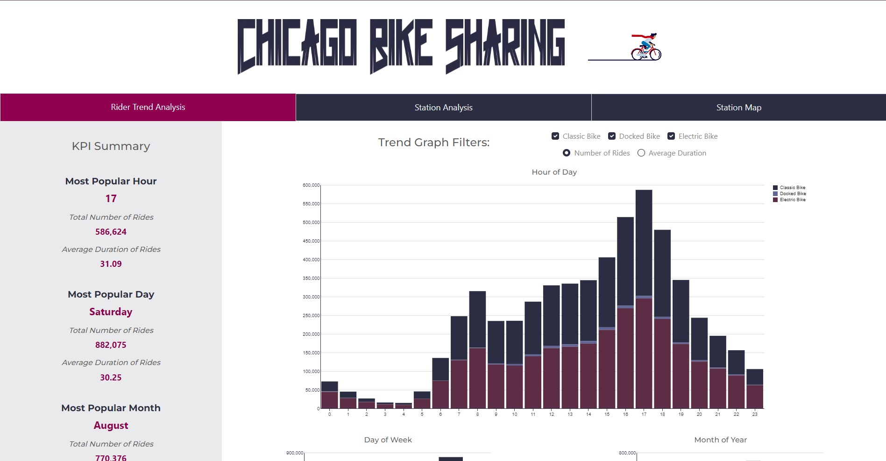
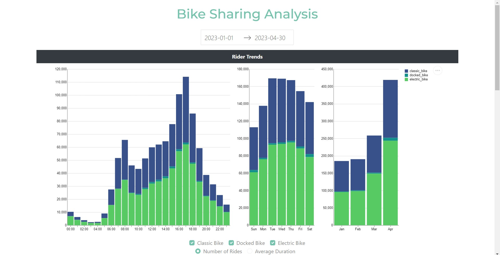
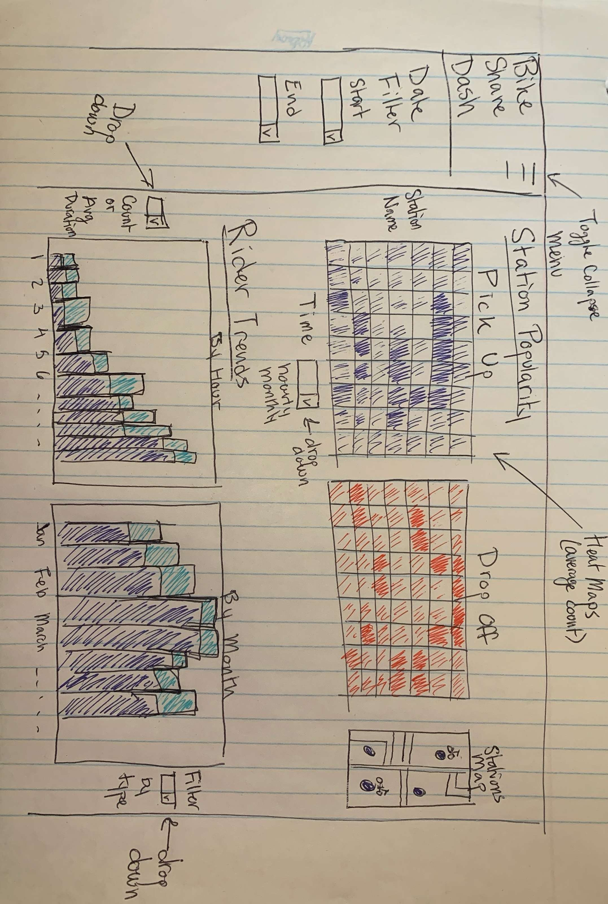

# Chicago Bike Sharing Dash App Deployed via Heroku   

App URL: [Chicago Bike Sharing Dash App](https://bike-sharing-py-dashapp-44627a5faee5.herokuapp.com/)       

The following project is a dashboard created using Python Dash, and deployed on Heroku. The goal is to visualize ride sharing data to help business stakeholders answer key decisions including:
1. What stations are the most popular?
2. When are they popular?
3. Are there particular stations that customers usually start their rides at and end at?
4. What is the bike availability at "hot" stations, how can we better re-shuffle bike inventory to maximize bike availability at stations?

Challenges:
The biggest challenge with the project was dealing with 1 year's worth of data (more than 3 million rows). Some techniques used to reduce the memory load included pre-calculating metrics for plotting, multi-indexing, and storing data as parquet files for efficient storage. In addition, with Heroku deployment, storing files on GitHub in LFS format, and reading them directly helped speed up app deployment. However, ultimately, due to the sheer size, rather than using 1 years worth of data, a reduced amount of 4 months had to be used to stay under the Heroku 512mb memory limit to prevent the app from crashing in version 1.

As a permanent solution, the date selector was retired, and as a result, the entire data set could be used. I concluded that having access to the full amount of data was more important than having a "cool" date selector feature. In addition, the UI, graphics, and layout of the app were all changed in the imporved version. Most importantly, a KPI Summary bar was added on the left to help highlight some of the key information from the plots on the right.
      

### Improved Dash App    
    
   

### Dash App Version 1    
     
    
       
### Initial App Sketch     
        

